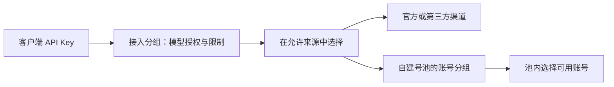

# 功能收敛与菜单建议

日期：2026-09-10。状态：讨论稿，等待用户完善；没有修改业务代码或线上服务。

相关文档：[功能候选总表](feature-integration-candidates.md)、[模型管理候选项](model-management-candidates.md)、[渠道与号池监控](monitoring-proposal.md)。候选表用于选择，不代表全部实施。

## 已确认的使用场景

- 同时接入外部上游与自建号池。
- 接入方式包括官方 API Key、已有 OAuth 账号、第三方渠道。
- 下游获取对应分组的 Key 即可调用模型。
- 重点关注模型发现、价格同步、模型测试以及图片和视频兼容。
- 需要按模型供应商分类，监控自定义名称的上游渠道与自建号池，支持探针、成功率、首字延迟和缓存率。
- 需要渠道和号池的并发限制与调度优先级，并关注下游用户的并发控制；具体层级、默认值和客户标识方案见下方建议。
- 关注首页能否集中查看全站并发、RPM 等监控指标；下面补充首页展示建议，并区分现有账号槽位与待建设的全站指标。

## 建议的产品边界

围绕“管理来源 → 开放模型 → 按组发 Key → 查看调用”建设多来源 AI 网关。

建议暂不建设用户自行注册、钱包充值、套餐订单、支付、优惠券、返佣、SSO、插件市场和多副本集群。下游使用 Key 的流程并不依赖这些功能。保留成本统计、必要的额度限制和管理员审计；为同一用户多 Key 共用限额，可增加管理员维护的轻量客户标识。

三个参考项目作为产品与实现参考，按需选择功能；不把三个完整后台拼接进来。降低复杂度需要减少实际建设的子系统，仅折叠菜单并不能减少维护成本。

## 一级菜单建议

| 菜单 | 页面内容与常用动作 |
| --- | --- |
| 概览 | 全站运行请求数、最近 60 秒 RPM、排队与媒体任务、成功率/延迟、来源容量、今日用量/成本和异常摘要；点击下钻监控或请求记录 |
| 上游渠道 | 官方与第三方 URL/凭据接入、启停、并发上限、默认调度优先级/权重、连接测试与同步模型；详情查看能力、采购价格与健康状态 |
| 自建号池 | 账号列表、账号分组、额度与健康；号池总并发与默认优先级、账号并发/权重、导入、批量操作与凭据刷新 |
| 模型管理 | 模型目录、价格管理、测试工作台；维护对外名称、能力、可用来源，执行同步、发布及文本/图片/视频测试 |
| 分组与密钥 | 接入分组的模型/来源策略和组限额；客户标识及其跨 Key 总限额；Key 的创建、限额、停用、到期与调用配置 |
| 监控中心 | 按供应商比较渠道与号池健康；真实流量指标、主动探针、模型/账号明细、异常与恢复记录 |
| 请求与用量 | 请求日志、用量、成本、错误定位；启用异步图片/视频后增加媒体任务标签页 |
| 系统设置 | 管理员安全、通知、网络代理、备份、更新和外观；放在侧栏底部 |

上游渠道与自建号池均为日常高频入口，分别可见。厂商作为列表筛选项，不为每家厂商增加一级菜单。

同步、导入、测试主要是页面动作；只有需要持续查看的历史记录才提供标签页或详情页。价格管理位于模型管理内部；涉及具体渠道的采购价从渠道详情进入同一份数据。

监控是用户明确关注的持续运营任务，因此在原七项建议上增加“监控中心”，形成八个一级入口。概览只保留健康摘要；监控负责发现和定位异常；请求与用量负责逐条追踪及用量/成本核对，三者复用同一数据来源并相互跳转。

## 首页的全站监控摘要

当前首页已有账号调度卡片：默认账号并发、总槽位、已占用/总槽位、空闲槽位和账号状态；还有请求量、Token、费用、缓存、首字均值及健康/趋势信息。`useDashboard.ts` 每 30 秒刷新一次。当前的账号槽位不是完整的下游全站逻辑请求并发，也没有独立的实时 RPM 指标；以下为待实现建议。

首页从上到下建议分为：

1. **当前负载**：运行请求数、最近 60 秒业务入站 RPM、等待数、未完成媒体任务数；提供峰值趋势和更新时间。
2. **服务表现**：所选窗口的成功率、首字 P50/P95、缓存命中/Token 占比；TPM 可作为展开指标，明确采集覆盖率。
3. **来源摘要**：按供应商展示渠道与自建号池的健康、占用和异常数；点击进入监控中心并保留筛选条件。
4. **今日统计与待处理**：请求量、Token、成本、限流与故障提醒，保留近期请求的快速入口。

首页默认全站范围，可筛选供应商；各指标注明自身时间窗口。运行请求与来源占用分开，不把客户、Key、分组、渠道的占用相加。未配置全站硬上限时只显示运行数，不能用不同模型权限的账号槽位之和冒充全站承诺容量。

实时摘要可先采用约 5 秒刷新的轻量接口，窗口统计仍按最近 60 秒等独立规则计算，后台不可每次刷新扫描全量历史。刷新周期属于建议，不代表当前已经改为 5 秒。最新数据不可用时保留最后快照并显示过期状态，不显示为零。

详细计数规则见 [监控方案中的全站指标](monitoring-proposal.md)。

## 分组的含义

需要区分两个对象，界面采用不同名称：

- **号池内的账号分组**：组织实际账号，回答“哪些账号放在一起使用”。保留现有账号可以加入多个分组的含义。
- **下游接入分组**：定义模型访问与来源策略，回答“这个 Key 能用什么，允许从哪里调用”。入口为“分组与密钥”。

当前代码的 Client Key 关联的是 AccountGroupId，不能仅改菜单文字就当成完整的下游接入分组。未来实现需要独立策略模型和显式迁移；保留旧 Key 的有效权限，包括未绑定代表全部账号、绑定空池不会扩大权限等现有行为。

新建 Key 的初期体验建议为一个 Key 选择一个接入分组，自动继承组策略。旧 Key 的多账号分组授权通过兼容策略表达，不静默丢弃或扩大范围。

接入分组详情建议采用四个标签页：

1. **模型与来源**：开放哪些模型；每个模型允许哪些上游渠道或账号分组供应，以及来源顺序。
2. **限额与价格**：组并发/RPM、可选预算；需要对外计价时再启用倍率或模型价格覆盖。
3. **API 密钥**：该组 Key、备注、状态、到期时间、可选单 Key 限额与调用配置。
4. **用量**：该组及其 Key 的请求、费用与失败情况。

对外价格与上游参考价、采购成本分开。OAuth 账号的订阅成本不能直接当成官方 API 的逐 Token 采购价。

## 并发限制与调度优先级

以下是需求细化建议，具体配置值尚未确定。当前已有账号并发/权重、Key 并发/RPM，以及冷却、会话亲和和账号轮换等基础；渠道、号池独立总上限、下游接入分组及客户跨 Key 限额需要相应的新实现，不能只在页面增加字段。

### 限制分别作用于哪个对象

| 层级 | 作用 | 配置入口 |
| --- | --- | --- |
| 渠道 | 所有下游分组和 Key 通过这个实际渠道的合计占用不能超过上限 | 上游渠道详情 |
| 自建号池 | 选中该号池的所有调用共享池总上限 | 自建号池详情 |
| 单个账号 | 该实际账号被不同账号分组使用时，仍共享同一个账号上限 | 账号详情 |
| 下游接入分组 | 该接入分组下所有客户/Key 的合计占用 | 分组与密钥 → 分组 |
| 客户（用户标识） | 同一客户拥有的全部 Key、跨接入分组的合计占用 | 分组与密钥 → 客户 |
| API Key | 单个 Key 的占用，继承客户/组约束并可设置更小的独立上限 | 分组与密钥 → API 密钥 |

客户只需名称/备注、状态、总限额和关联 Key，暂不依赖注册登录、钱包或套餐。创建 Key 时可以选择所属客户；无客户的独立 Key 继续由 Key 和分组限额约束，界面明确显示“未关联客户”。不能用共享一个接入分组来代替同一客户的跨 Key 归属。

各层限制独立累计、同时成立，不是子级覆盖上级，也不能只取几个配置数值的最小值而忽略当前占用。例如客户总并发 10，名下两个 Key 各 8，合计仍最多 10；同一渠道上限 20，被三个接入分组使用时，渠道总占用仍最多 20。

账号加入多个号池或账号分组不复制实际容量。一次调用明确归属选中的号池，同时占用实际账号的全局槽位；集合视图汇总按稳定账号 ID 去重。若多个渠道配置共享同一上游项目/凭据配额，也需要关联同一配额范围，不因改名或复制渠道配置获得更多实际容量。

界面区分“继承”“明确上限”和允许时的“本层不限”，显示最终生效值；本层不限不绕过其他层约束。启停单独设置，不用含义不明的数字 0 同时代表禁用、继承或无限制。

### 来源优先级与账号调度

渠道和号池设置默认来源优先级、同级权重；接入分组默认继承，也可以对允许的来源覆盖，显示覆盖位置和最终值。覆盖只改变该组的选择策略，不提高来源的全局容量上限。

初期建议约定“优先级 1 最高，2 为下一档”；权重仅在同一优先级的可用来源间生效，决定长期分配倾向，不承诺短窗口精确比例。

选择过程先过滤授权范围、模型/协议能力、启停、健康与剩余容量，再选优先级，在同级按权重选择；选中号池后，继续使用池内账号权重、轮换、冷却和会话策略。会话续接的 Provider/账号绑定和发送边界仍是硬约束，不能为了更高优先级破坏续接语义。

示例：自建号池优先级 1、总并发 20；A/B 渠道优先级 2，各并发 10，同级权重 2:1。需要在接入分组中显式允许“高优先级来源满载时使用后续来源”；未允许则按该组的排队/拒绝策略处理。故障后重试还须满足原有安全重试条件。

来源优先级回答“先使用哪个上游”，不等于“哪个客户插队”。客户之间的公平排队可在有实际需要时单独设计，不把两种优先级混成一个字段。

### 占用生命周期与超限反馈

- 并发限制同时进行的工作；RPM 限制每分钟请求量；TPM 限制 Token 速率。三者不互相替代，按供应商和模型需要逐步提供，显示各自单位。
- 文本/SSE 的运行槽位持有到请求完成或确认终止，不在收到响应头/首字时释放。WebSocket 的活跃生成与空闲连接分开计数，连接数可有独立上限。
- 图片/视频的异步任务另设“未完成任务上限”，可按客户、Key、组和来源配置。提交返回任务 ID 只结束一次 HTTP 提交，任务额度仍保留至终态；查询请求不重复占用生成名额，排队数量也设边界。
- 上游是否仍执行不明确时保留待核对状态，不能把本地超时或停止查询当成任务已结束。异步任务需持久记录并在重启后核对，不能仅靠短租约到期就假定容量已经释放。
- 准入与占用获取需要并发安全；多层获取失败时回收已获取的临时占用。超时、取消、异常和重启路径必须避免泄漏或过早释放，重试不重复累计同一逻辑请求的客户/Key 占用。
- 默认采用快速拒绝或有界的短等待，具体策略待定；等待时长和队列长度独立限制，不长期占住来源槽位排队。客户/Key 限额触发与全局来源容量耗尽使用可区分的错误类型，兼容所选对外协议，避免客户端无限立即重试。
- 手动测试和探针有独立的并发/预算限制，同时受实际来源和账号容量约束；按分组调用测试仍执行所选 Key 的授权和限额，不因标记为测试就绕过准入。统计标记仅由受信任的内部执行器设置。

监控显示“当前占用 / 上限”、排队、达到上限次数和阻塞层级。管理员能看到具体渠道/账号原因；下游返回可理解的限流信息而不暴露内部账号或凭据。满载属于容量状态，不自动等同于来源故障；首字时间区分等待与实际来源响应阶段。

分客户限额和过载处理的原则可参考 [Google SRE：Handling Overload](https://sre.google/sre-book/handling-overload/)。这里的具体层级、字段和默认值是本项目建议。

## 模型与路由的职责

模型管理维护“这个模型是什么、有哪些能力、哪些来源可以提供、价格资料与测试证据”。来源配置提供全局容量上限与默认优先级/权重；接入分组维护“该组允许使用哪些模型与来源”，继承或明确覆盖来源的默认选择顺序。各页面引用同一来源与组策略，不创建互不关联的重复路由配置。

模型详情可以显示关联分组和路由摘要，并链接到相应分组编辑；分组的模型选择器复用模型目录与测试结果。添加渠道后同步出的模型先进入目录，经过启用和授权才出现在下游可用列表。

路由分两步：先从该组允许的渠道/账号分组中选来源；选中账号分组后，再使用现有的账号轮换与健康调度。

例如，“日常组”开放某个模型，来源依次为自建账号分组 A、第三方渠道 B；“官方组”开放同一模型，但只允许官方渠道 C。对应的 Key 调用同一个对外模型名时，使用各自分组的来源策略。

只有来源支持所需协议与能力，且请求仍可安全重试时，才允许切换；切换不能越过分组授权，也不能把不同能力的同名模型视为等价。视频提交结果不明时需先查任务状态，不能盲目重新生成。

## 模型管理的页面结构

- 内部入口为“模型目录 / 价格管理 / 测试工作台”；测试工作台使用独立页面，暂不新增一级菜单。具体交互见 [模型管理中的测试工作台建议](model-management-candidates.md)。
- 列表支持厂商、能力、来源、启用状态及测试状态筛选。
- 顶部提供“同步模型”“同步价格”“批量测试”等动作；未处理变化显示计数。
- 模型详情使用“基本信息 / 可用来源 / 价格 / 测试记录”标签页。
- 同步新模型与同步价格分别显示差异；未知价格不能显示为免费，人工覆盖不能被后台同步覆盖。
- 文本、图片理解、生图、图片编辑、视频理解、视频生成分别记录能力。目录可以先容纳这些能力，实现了适配并验证后才能标记为可调用。
- 视频任务及其他异步媒体任务统一进入“请求与用量”，模型页面负责配置和发起测试，不再建立第二套任务管理。
- 模型、渠道、号池和分组详情的“测试”快捷入口跳转到同一工作台并预填上下文。区分固定来源测试与按下游分组/Key 的完整调用测试。
- 图片提供素材上传、产物预览及编辑对比；视频提供后台任务状态与播放器。工作台和媒体任务列表引用同一任务，关闭页面不丢失进度。

## 建议实施顺序

1. **跑通一个完整调用链**：选现有号池与一个外部渠道，建立统一来源引用、最小模型目录、接入分组和 Key 授权，完成请求追踪，并保留监控所需的供应商/模型、来源尝试和真实请求/测试区分。菜单随可用功能出现。
2. **完善日常运营**：批量导入预览与失败重试、模型/价格同步、来源级模型测试、组限额，以及按供应商分类的渠道/号池监控、定时文本探针和站内异常记录；再按实际需要逐个增加厂商适配。官网列出模型并不代表当前凭据可调用。
3. **扩展多模态与自动化**：先补齐现有图片能力，再接目标视频厂商及任务状态/结果管理；按使用量增加账号轮巡、缓存专项探针、通知和可选恢复联动。

第一轮建设完整调用链，不需要先完成所有厂商、所有协议、所有计费维度。用户关注的模型同步、定价、测试以及来源监控属于核心方向；视频任务属于独立的后续实现工作。

## 相对当前界面的调整

- “账号管理”和“分组管理”合并到“自建号池”，账号分组作为内部标签页。
- “API 密钥”扩展为“分组与密钥”；实际实现依赖前述策略模型，而非只改标题。
- 设置中的模型映射迁入“模型管理”；池内轮换设置归入号池，跨来源选择归入接入分组。
- “使用统计”扩展为“请求与用量”。
- “主题设置”并入系统设置中的外观配置，保留侧栏便捷主题切换。
- 新增“上游渠道”“模型管理”“监控中心”，形成八个一级入口。

菜单采用常用动作优先、高级选项按需展开的原则。参考：[Nielsen Norman Group：Progressive Disclosure](https://www.nngroup.com/articles/progressive-disclosure/)。
